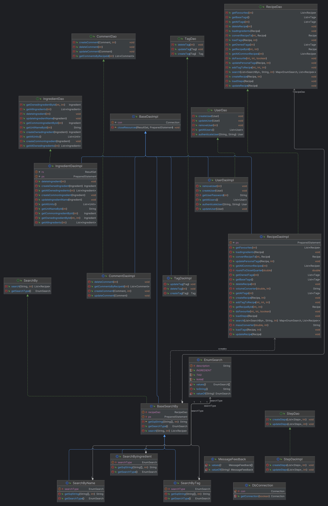
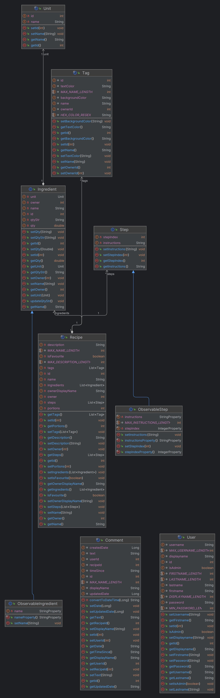
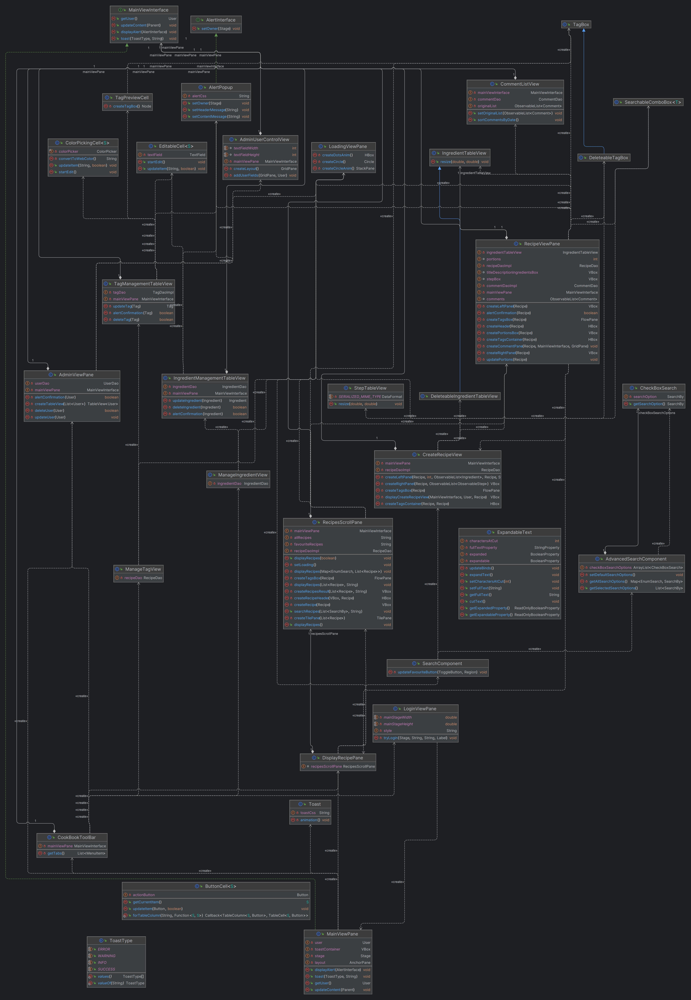

# Cookbook

## Table of Contents
- [Overview](#overview)
  - [UML Diagrams](#uml-diagrams)
    - [Controller](#controller)
    - [Model](#model)
    - [Viewer](#viewer)
- [Features](#features)
- [Installation and Configuration](#installation-and-configuration)
- [Usage](#usage)
- [Screenshots](#screenshots)
  - [Welcome Screen](#welcome-screen)
  - [Recipe Overview](#recipe-overview)
  - [Search](#search)
  - [Favourites](#favourites)
  - [Detailed Recipe View](#detailed-recipe-view)
  - [Personal Tag View](#personal-tag-view)
- [Contributing](#contributing)
- [License](#license)
- [Project Status](#project-status)


## Overview 

## UML Diagrams

### Controller
<div style="display: flex; align-items: flex-start; margin-bottom: 20px;">
  <div style="border: 1px solid #ccc; padding: 10px;">
    
  </div>
  <p style="margin-left: 20px;">
  The controller is built up in a DAO (data access object) pattern fashion like way, where the classes of the impl holds all the implementations to acquire data from the sql database. 
  </p>
</div>

### Model
<div style="display: flex; align-items: flex-start; margin-bottom: 20px;">
  <div style="border: 1px solid #ccc; padding: 10px;">
    
  </div>
  <p style="margin-left: 20px;">
  The model holds data for the different tables in the database.
  </p>
</div>

### Viewer
<div style="display: flex; align-items: flex-start; margin-bottom: 20px;">
  <div style="border: 1px solid #ccc; padding: 10px;">
    
  </div>
  <p style="margin-left: 20px;">
    <ul>
      <li><h3>The view that the user sees when logging in is defined in Loginviewpane.</h3></li>
      <li><h3>After logging in, the view will be split up into a MainViewPane, which is a BorderPane+AnchorPane combination.</h3></li>
      <li><h3>The top will be a toolbar, and the center will contain whatever view the user navigates through.</h3></li>
      <li><h3>This view is set with the <code>updateContent</code> function in <code>mainViewPaneInterface</code>.</h3></li>
      <li><h3>The interface of the main view is injected around and used throughout the application to update the content in the center.</h3></li>
      <li><h3>It is also utilized for toasting the user, stacking toasts on top of eachother in a VBox in the Anchorpane bottom left corner. </h3></li>
    </ul>
  </p>
</div>

## Features
- Signing in and out
- Create, Read, Update and Delete (CRUD) recipes
- Tags
  - Coloured personal tags
- Personal ingredients
- Comments
  - Timestamps when created/updated
  - Expandable text for longer messages
- Favourites
- Search by (name, tags or ingredient)
  - Advanced search, can combine all of the available options 
- Altering portion sizes
  - Portion adjustment “heads-up”
  - "Smart" portion adjustment, the units rounds to quarters and converts for example 1200g becomes 1.25kg 
- Managing users
- Feedback
  - Multithreading, displays a loading animation instead of the application freezing
  - Toasts for success or error messages
- Drag and droppable steps


## Installation and Configuration

### Prerequisites
- Make sure you have OpenJDK >= 21 installed.
- Have a database ready and note down its URL, username, and password.

### Steps

#### 1. Clone the Repository
First, you need to clone this repo.

#### 2. Copy Configuration Template
Open the configuration template file located at `/app/config.properties.template` in a text editor of your choice, and copy all the contents.

#### 3. Create Configuration File
In the same directory as the template file, create a new file named `config.properties`:

#### 4. Paste Configuration
Open the newly created `config.properties` file and paste the contents you copied from `config.properties.template`.

#### 5. Database Dump
In the root directory of your project, you will find a database dump file named `CRUDrecipesDBSnapShot.sql`. This file can be used to set up your database schema.

#### 6. Update `config.properties`
The `config.properties` file needs to be updated with your database information. Open `/app/config.properties` and:
- Locate the line `database.url=` and set it to your database URL, e.g., `database.url=jdbc:mysql://localhost:3306/yourDatabaseName`
- Locate the line `database.user=xxx` and replace `xxx` with your database username, e.g., `database.user=myDatabaseUser`
- Locate the line `database.password=xxx` and replace `xxx` with your database password, e.g., `database.password=myDatabasePassword`

### Example Configuration (`config.properties`)
Here's an example of what the `config.properties` file might look like:
```
database.url=jdbc:mysql://localhost:3306/yourDatabaseName
database.user=myDatabaseUser
database.password=myDatabasePassword
```

### Running the Application
After setting up the configuration, you can build and run your application with Gradle.
Please note, the default login for admin is `admin : admin123`

1. Build the project:
   ```
   ./gradle build
   ```

2. Run the project:
   ```
   ./gradle run
   ```

## Screenshots

### Welcome Screen


**On startup of the cookbook application, you are welcomed with a login screen. After a successful login, the stage is closed and a new one is opened.**

### Recipe Overview


**After successfully logging in, the user is presented with a scrollable, tiled view of all recipes. Hovering over a recipe reveals a longer, more detailed description provided by the recipe's author. Below each recipe are tags assigned by the author.**

### Search


**If a user doesn't immediately find a desired recipe, a quick search can help them find one that suits their taste or matches the ingredients they have at home.**

### Favourites


**If a user likes a recipe, they can add it to their favorites by clicking the star. They can later view all their favorites by clicking the star in the search component.**

### Detailed Recipe View


**When a user finds a recipe they like, they can click on it to view detailed descriptions of the required ingredients and the steps to follow.**

### Personal Tag view.


**Users can change color and name on their tags.**


## Contributing

## License
MIT License

Copyright (c) 2024 [Andreas Nilsson, Christian Artback, Vilmer Lennartsson, Elias Jaensson, Karl Tuomisto, Sadek Alashkar]

Permission is hereby granted, free of charge, to any person obtaining a copy
of this software and associated documentation files (the "Software"), to deal
in the Software without restriction, including without limitation the rights
to use, copy, modify, merge, publish, distribute, sublicense, and/or sell
copies of the Software, and to permit persons to whom the Software is
furnished to do so, subject to the following conditions:

The above copyright notice and this permission notice shall be included in all
copies or substantial portions of the Software.

THE SOFTWARE IS PROVIDED "AS IS", WITHOUT WARRANTY OF ANY KIND, EXPRESS OR
IMPLIED, INCLUDING BUT NOT LIMITED TO THE WARRANTIES OF MERCHANTABILITY,
FITNESS FOR A PARTICULAR PURPOSE AND NONINFRINGEMENT. IN NO EVENT SHALL THE
AUTHORS OR COPYRIGHT HOLDERS BE LIABLE FOR ANY CLAIM, DAMAGES OR OTHER
LIABILITY, WHETHER IN AN ACTION OF CONTRACT, TORT OR OTHERWISE, ARISING FROM,
OUT OF OR IN CONNECTION WITH THE SOFTWARE OR THE USE OR OTHER DEALINGS IN THE
SOFTWARE.

## Project status
The project is no longer active but there are further improvements and missing features to be implemented

Further improvements and missing features:
- Welcoming animation
  - The application should start by showing a short little animation and then let the user log in.
- Weekly Dinner List
  - As a user I want to be able to create weekly dinner lists for several weeks so that I can display them later
  - As a user I want to be able to see the list of weekly dinner lists
  - As a user I should be able to select and display the dinner list for a week
  - As a user I want to add dishes to created weekly dinner lists (one, two or more dishes per day)
- Shopping List
  - As a user I want to be able to generate a shopping list with what I need to by for a week
  - As a user I want to be able to modify the shopping list so that it does not contain things I already have at home
- Sharing recipes
  - As a user I want to be able to send a recipe to another user so that he/she can cook it
  - As a user I want to add a message to a recipe that I send to another user to inform why I did it
- Help system
  - As a user I want access to a help system with a tutorial of how the program works so that I can understand how to use it
- Save reminder
  - When the user edits or creates new tags or ingredients and tries to navigate to another page there should be a reminder to save changes.
- Breadcrumbs
  - To improve the user experience when navigating the application would be a page back button
- General UI improvements
